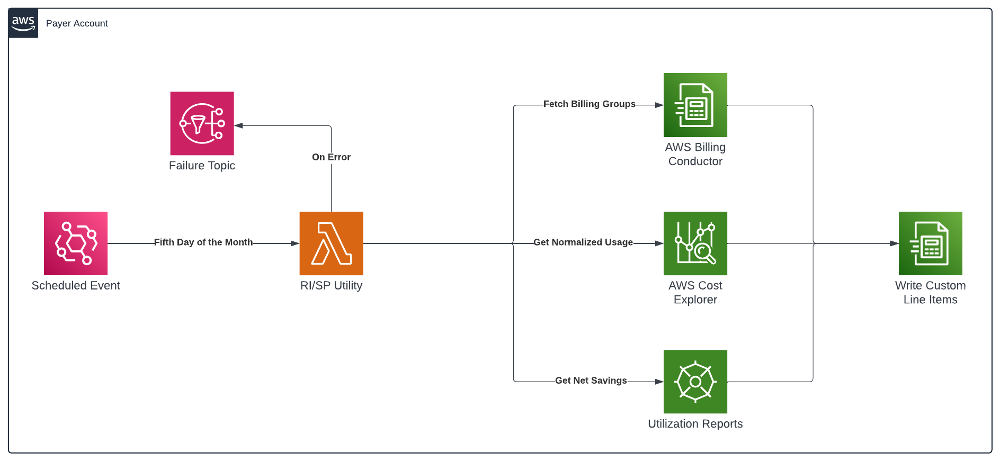

## AWS Billing Conductor (ABC) Overview
AWS Billing Conductor is a [priced service](https://aws.amazon.com/blogs/aws-cloud-financial-management/ad-everything-you-need-to-know-about-aws-billing-conductors-new-pricing-model/) in the AWS billing suite designed to support showback and chargeback workflows for any AWS customer who needs to enforce visibility boundaries within their Organization or add custom rates unique to their business. This alternative version of the monthly bill is called a pro forma bill.

## How Billing Conductor Handles Savings Plans (SPs) and Reserved Instances (RIs)
It’s important to note that AWS Billing Conductor does not change the application of SPs or RIs in the account’s billing family. It only affects how the application is visible in the pro forma views. To conceptualize the difference between the two, consider the intention behind each of the two products. When applying SPs and RIs, the AWS billing system prioritizes maximizing the discount benefit of each product to save customers the most money possible. When calculating pro forma costs, AWS Billing Conductor prioritizes creating the prescribed view for each billing group by enforcing strict visibility boundaries within the Organization. 

By default, AWS Billing Conductor shares the benefits of Savings Plans and Reserved Instances that were purchased in a linked account belonging to a billing group with all accounts placed in the same billing group. However, benefits from any Savings Plans or Reserved Instances owned outside a billing group are not included in that billing group’s pro forma cost. A few examples of how SP and RI benefits will or will not appear in pro forma data: 
- A Savings Plan was purchased in the payer account, which is not in any billing group. Billing groups will not see any SP benefit in their pro forma view. **Sharing purchases made outside of billing groups (e.g., in the payer account) is the primary use case for this tool.**
- Linked account 1 is in billing group A, and linked account 1 has received benefit from a Savings Plan or Reserved Instance that was purchased outside the billing group A in the consolidated bill (i.e., what the customer pays to AWS). Linked account 1 will not see any benefit in their pro forma view. 
- Linked account 2 owns an RI and is in billing group A. Linked account 2 consumed its own RI during the month. It will see the benefit of that RI in its pro forma view as well. 
- Linked account 2 owns an RI and is in billing group A. Linked account 2 did not have any usage that the RI could apply to and neither did any account in billing group A. In the consolidated bill (i.e., what the customer pays to AWS), the RI benefit was applied to linked account 3, which is not in billing group A. Linked account 2’s pro forma view will show the RI as unused. 
- Linked account 2 owns an RI and is in billing group A. Linked account 2 does not have usage that the RI could apply to. However, linked account 3 (also in billing group A) does have usage that the RI could apply to. In the consolidated bill (i.e., what the customer pays to AWS), the RI applied to linked account 4, which does not belong to billing group A. In the pro forma view, the RI was applied to linked account 3 because ABC constrains application to the billing group where it was purchased regardless of whether sharing is enabled.

## Utility Logic Overview
This utility shows how ABC custom line items can be used to distribute the benefits of SPs and RIs purchased outside of billing groups (e.g., in a payer account) to linked accounts belonging to billing groups. The solution's logic is as follows:
- Trigger on the fifth of every month using EventBridge
- Determine the date range of the previous billing period (i.e., the first and last day of the previous full month)
    - For example, if the current date is January 5th, the previous billing period would be December 1st to 31st
- Get the account associations from Billing Conductor for the previous billing period (i.e., which accounts belonged to which billing group during the last full month)
- Pull the number of EC2 running hours by instance type via the Cost Explorer API and calculate normalized hours based on [normalization factor](https://docs.aws.amazon.com/AWSEC2/latest/UserGuide/apply_ri.html)
    - Include normalized Fargate usage if the `INCLUDE_FARGATE_FOR_SAVINGS_PLANS` feature flag is enabled (disabled by default)
    - Include normalized Lambda usage if the `INCLUDE_LAMBDA_FOR_SAVINGS_PLANS` feature flag is enabled (disabled by default)
- Pull the number of RDS running hours by instance type via the Cost Explorer API and calculate normalized hours based on [normalization factor](https://docs.aws.amazon.com/AWSEC2/latest/UserGuide/apply_ri.html)
- Pull the net savings for the previous billing period per Savings Plan and Reserved Instance
- Divide the net savings for each commitment proportionally across the linked accounts that belong to a billing group
  - Each linked account's percentage is its normalized usage divided by the total normalized usage for all accounts belonging to a billing group
- Create a custom line per commitment per account
- Write the custom line items to Billing Conductor if the `DRY_RUN` flag is disabled (enabled by default for testing purposes), otherwise only return the output (viewable in the Lambda Console) 
- If an error occurs, an SNS topic is notified
- In regard to managed services, the initial solution only covers RDS, but includes code comments about how to expand to other services such as ElastiCache and OpenSearch

## Architecture


The core functionality resides in a Lambda function built using [AWS Serverless Application Model (SAM)](https://aws.amazon.com/serverless/sam/). The infrastructure is defined using a CloudFormation template with the following resources **intended to be deployed in the payer account**:
- Lambda function using Python 3.12 
- EventBridge rule using a `cron` expression to trigger on the fifth day of every month (i.e., so that the bill for the previous month is finalized)
- An SNS topic to subscribe to on errors
- An IAM policy and execution role with the minimum required permissions

## Minimum IAM Permissions Required
From the `template.yaml` file:
```yaml
Policies:
  - Statement:
      - Sid: BillingConductorAndCostExplorer
        Effect: Allow
        Action:
          - billingconductor:ListAccountAssociations
          - billingconductor:CreateCustomLineItem
          - ce:GetCostAndUsage
          - ce:GetReservationUtilization
          - ce:GetSavingsPlansUtilizationDetails
          - organizations:ListAccounts
        Resource:
          - '*'
  - Statement:
      - Sid: SNSPublishToFailureTopic
        Effect: Allow
        Action:
          - sns:Publish
        Resource:
          - !Ref rLambdaFailureTopic
```

## Local Setup 

### Creating a Virtual Environment
```shell
git clone git@github.com:aws-samples/aws-billing-conductor-sp-ri-benefit-utility.git
cd aws-billing-conductor-sp-ri-benefit-utility
python3.12 -m venv '.venv'
. .venv/bin/activate
pip install -r sam_sp_ri_utility/requirements.txt
```

### Running Unit Tests
```shell
pytest
```

## Deployment

### Building Using AWS SAM
```shell
sam build
```

### Deploying Using AWS SAM
First, ensure that [local AWS credentials are configured correctly](https://docs.aws.amazon.com/cli/latest/userguide/cli-chap-configure.html).
```shell
sam deploy --guided
```

## Leveraging the Sample
By default, the Lambda function **does not** write the custom line items to Billing Conductor. To disable dry run mode, change the Lambda environment variable called `DRY_RUN` to `Disabled` either via the Console or CloudFormation template. **Before doing so, we strongly recommend that you review what would have been written to ensure that the benefit distribution meets your business requirements.** For feature ideas and/or questions that could apply to all ABC users, please open an issue in this repository. Contact your account team or open an AWS support case for 1:1 discussions that require specifics that cannot be shared publicly. 

## Edge Cases and Additional Considerations
- This utility assumes that ABC has been configured and some linked accounts are associated with billing groups. The payer (or account where purchases are centrally made) must not belong to a billing group. It also assumes that there is at least one month of ABC data for each billing group given that it looks back to the previous month.
- If some or all of the linked accounts that belong to billing groups have commitment purchases, be aware that these accounts would receive benefits in the pro forma data both from the purchases made at the linked account level **and** outside the billing group (e.g., in the payer) as well. However, this utility does not allocate any benefits for purchases made within a linked account belonging to a billing group since ABC does this already.
- Spot usage is ignored by the EC2 and Fargate normalized usage calculation functions. This is intended to mirror the way that Savings Plans and Reserved Instances are applied by AWS billing systems. [Unused ODCRs](https://docs.aws.amazon.com/cur/latest/userguide/monitor-ondemand-reservations.html) (i.e., usage types containing `UnusedBox` and `UnusedDed`) are also excluded from the total eligible usage and every linked accounts' eligible usage.
- Not all sizes (e.g., `m6i.metal`) are contained in the normalization map. If an instance size is not found, the normalization factor defaults to `1.0`. In addition, only size is currently considered. Users may also want to customize the weights based on instance family as well (e.g., for GPU usage).
- It is possible that a commitment can have negative net savings due to low utilization. If this occurs, the negative value will be distributed to the eligible linked accounts as a fee.
- The distribution logic **does not** match benefits to usage (e.g., only applying the benefits for an RDS RI to accounts with the region, instance type, etc. specified by the commitment). This aims to support centralized purchasing strategies.
- In regard to non-US currency payers, since the sample utility distributes benefits based on normalized usage hours, it is not reliant on any one currency for its calculation logic (other than net savings). However, we recommend that every customer using the utility, regardless of the currency they use, validates that the custom line items produce the expected results.
- Fargate and Lambda usage are ignored by default because Compute Savings Plans cover EC2 usage first due to [higher savings percentage over On-Demand](https://aws.amazon.com/savingsplans/compute-pricing/). To enable these features, change the `INCLUDE_FARGATE_FOR_SAVINGS_PLANS` and/or `INCLUDE_LAMBDA_FOR_SAVINGS_PLANS` Lambda environment variable(s) to `Enabled`.
- Lambda has a 15-minute maximum timeout. If the function cannot complete within that time period, the code may need to leverage a different offering like Fargate that can support longer run times.

## Cost
For a complete list of resources deployed by this utility, see the `template.yaml` file. The Lambda function leverages ARM and runs once per month by default. The number of seconds will vary based on the environment. See the [Lambda pricing](https://aws.amazon.com/lambda/pricing/) for details. The core logic leverages the Cost Explorer API for the following:
- Pulling Savings Plans and Reserved Instances utilization 
- Fetching cost and usage for EC2, RDS, Lambda, and Fargate

Each Cost Explorer API request costs [0.01 USD](https://aws.amazon.com/aws-cost-management/aws-cost-explorer/pricing/). Monitor these costs via Cost Explorer by filtering to the `Cost Explorer` service and/or by API operation (i.e., `GetCostAndUsage`, `GetReservationUtilization`, `GetSavingsPlansUtilDetails`, and `GetSavingsPlansUtilization`). The unit tests located in the `sam_sp_ri_utility/test` directory mock API calls by patching SDK methods. To test locally without incurring costs, modify these Python objects to emulate API calls. 

## Security

See [CONTRIBUTING](CONTRIBUTING.md#security-issue-notifications) for more information.

## License

This library is licensed under the MIT-0 License. See the LICENSE file.